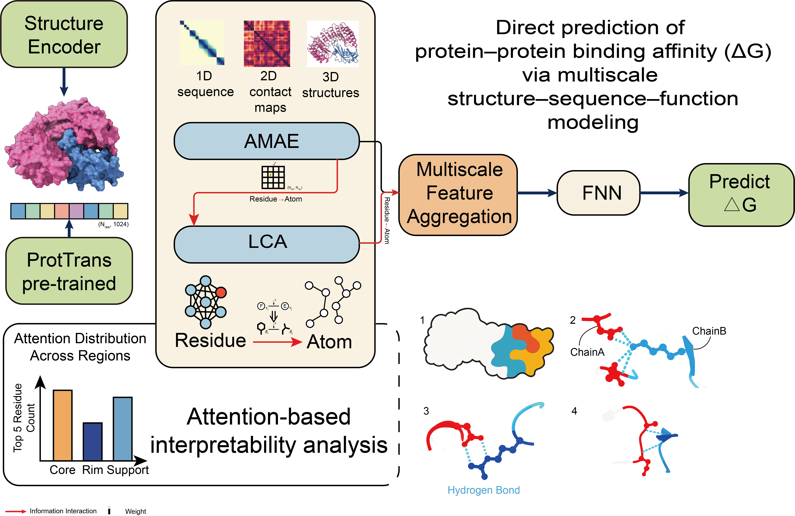

# MIRAGE

Interpretable Multilevel Interaction Modeling for Robust Protein-Protein Affinity

MIRAGE (Multi-level Interaction modeling for Robust Affinity prediction via Graph-based Encoding) is an interpretable graph-based framework for direct protein-protein binding affinity prediction. Unlike mutation-impact models that require paired wild-type and mutant structures, MIRAGE predicts the binding affinity of a single protein complex structure by jointly modeling 1D sequence context, 2D residue contact maps, 3D structural geometry, and atom-level side-chain information.



## Table of Contents

- [Overview](#overview)
- [Key Features](#key-features)
- [Installation](#installation)
  - [Environment Setup](#environment-setup)
  - [ProtTrans Model](#prottrans-model)
- [Quick Start](#quick-start)
  - [Predicting Direct Binding Affinity](#predicting-direct-binding-affinity)
  - [Examples](#examples)
  - [Input and Output](#input-and-output)
- [Datasets](#datasets)
- [Model Training](#model-training)
  - [Training Protocols](#training-protocols)
  - [Training One Fold](#training-one-fold)
  - [Training Outputs](#training-outputs)
- [Data Preprocessing](#data-preprocessing)
  - [1. Prepare Complex Structures](#1-prepare-complex-structures)
  - [2. Generate Interface Region Files](#2-generate-interface-region-files)
  - [3. Generate ProtTrans Embeddings](#3-generate-prottrans-embeddings)
  - [4. Build Processed Dataset Files](#4-build-processed-dataset-files)
- [Configuration](#configuration)
- [File Structure](#file-structure)
- [FAQ](#faq)
- [Contact](#contact)
- [Affiliations](#affiliations)
- [Citation](#citation)
- [License](#license)
- [Keywords](#keywords)

## Overview

Protein-protein binding affinity is determined by coupled sequence, structural, and chemical determinants. Many existing predictors encode these factors as separate or weakly coupled streams, which limits their ability to model the hierarchical dependencies that underlie binding free energy.

MIRAGE addresses this problem by representing a protein complex as a graph and explicitly integrating:

- **1D sequence information**: amino acid identity, sequence distance, and ProtTrans residue embeddings.
- **2D contact information**: residue-residue spatial proximity and distance-derived pair features.
- **3D structural information**: residue-centric local coordinate systems and heavy-atom geometry.
- **Residue-to-atom information**: side-chain geometric descriptors that refine local interface modeling.

The model directly predicts binding affinity for a single complex. In this codebase the prediction target is named `DG` and follows the positive affinity-score convention used by PPB-Affinity:

```text
DG = -RT ln(KD)
```

Here `R = 0.001987 kcal/(mol*K)`, `T` is temperature in Kelvin, and `KD` is in mol/L. The thermodynamic binding free energy is therefore:

```text
DeltaG_bind = RT ln(KD) = -DG
```

## Key Features

- **Direct affinity prediction**: predicts complex-level binding affinity from one PDB structure, without requiring wild-type/mutant structure pairs.
- **Graph-based multi-level encoding**: integrates multidimensional features from sequence, contact map, and 3D structure.
- **AMAE module**: Affinity-focused Multidimensional Residue Feature Aggregation and Excitation Attention, designed for global messaging and feature-pathway recalibration across 1D/2D/3D residue interaction representations.
- **LCA module**: Local Cross-Attention, designed to transfer residue-level context to atom-level side-chain geometry for fine-grained interface modeling.
- **Interface-aware residue selection**: uses solvent-accessibility-based Core, Support, and Rim regions as model input.
- **ProtTrans residue embeddings**: incorporates fixed pretrained protein language model embeddings as sequence-derived features.
- **Interpretability**: attention analysis can be projected to interface regions and local contacts, highlighting biologically meaningful residues.
- **Robust benchmark performance**: the paper reports Rp = 0.70 and 0.69 on two blind external test sets when trained on A1741, and Rp = 0.91 on S1131 cross-validation.

## Installation

### Environment Setup

The project was developed on Ubuntu with PyTorch and CUDA. GPU is recommended for training and for large-scale ProtTrans embedding generation. CPU prediction is supported but slower.

```bash
conda create -n mirage python=3.11 -y
conda activate mirage
pip install -r requirements.txt
```

Main dependencies include:

- `torch`
- `biopython`
- `h5py`
- `MDAnalysis`
- `numpy`
- `pandas`
- `scikit_learn`
- `scipy`
- `matplotlib`
- `seaborn`
- `tqdm`
- `transformers`
- `sentencepiece`
- `tensorboard`
- `dm-tree`

See [requirements.txt](./requirements.txt) for the exact package list.

### ProtTrans Model

For automatic generation of `.h5` sequence embeddings, the repository expects the local ProtT5 model under:

```text
prottrans/prottrans/Rostlab/prot_t5_xl_half_uniref50-enc/
```

The bundled examples in [data/Example](./data/Example) already include `.h5` files, so they can be used directly without regenerating ProtTrans embeddings.

## Quick Start

### Predicting Direct Binding Affinity

Use [run_predict.py](./run_predict.py) to predict the direct binding affinity of one protein complex:

```bash
python run_predict.py <complex.pdb> <proteinA_chains> <proteinB_chains>
```

Arguments:

- `<complex.pdb>`: PDB file containing the whole protein complex.
- `<proteinA_chains>`: chain IDs belonging to partner A, for example `A`, `HL`, or `H,L`.
- `<proteinB_chains>`: chain IDs belonging to partner B, for example `B`, `D`, or `A`.
- `--model_path`: checkpoint path. The default is [data/model.pt](./data/model.pt).
- `--device`: `cuda`, `cuda:0`, or `cpu`. If omitted, the script uses CUDA when available.

### Examples

Run prediction on a bundled example:

```bash
python run_predict.py ./data/Example/1ATN_A_D/1ATN_AD.pdb A D
```

More examples:

| Complex | PDB Path | Protein A | Protein B |
| --- | --- | --- | --- |
| 1ATN_A_D | `data/Example/1ATN_A_D/1ATN_AD.pdb` | A | D |
| 1AVX_A_B | `data/Example/1AVX_A_B/1AVX_AB.pdb` | A | B |
| 1AVZ_B_C | `data/Example/1AVZ_B_C/1AVZ_BC.pdb` | B | C |
| 1AY7_A_B | `data/Example/1AY7_A_B/1AY7_AB.pdb` | A | B |
| 1B6C_A_B | `data/Example/1B6C_A_B/1B6C_AB.pdb` | A | B |
| 1BRS_A_D | `data/Example/1BRS_A_D/1BRS_AD.pdb` | A | D |
| 1BUH_A_B | `data/Example/1BUH_A_B/1BUH_AB.pdb` | A | B |
| 1BVN_P_T | `data/Example/1BVN_P_T/1BVN_PT.pdb` | P | T |

### Input and Output

For a PDB named `sample.pdb`, the prediction script uses same-stem feature files:

```text
sample.region
sample.h5
```

If `sample.region` does not exist, [run_predict.py](./run_predict.py) computes residue solvent accessibility for the complex and isolated partners, then writes a region file with residue labels:

- `COR`: Core
- `SUP`: Support
- `RIM`: Rim
- `SUR`: Surface
- `INT`: Interior

Prediction uses `COR`, `SUP`, and `RIM` residues, with truncation or padding to 128 residues.

If `sample.h5` does not exist, the script converts the PDB to FASTA and runs the local ProtT5 embedder. This step can be slow on CPU.

A successful prediction prints:

```text
Loaded region file.
Loaded ProtTrans h5.
MIRAGE predicted binding affinity (DG) for this complex: 12.743117 kcal/mol
DG definition: DG = -RT ln(KD), where R = 0.001987 kcal/(mol*K), T is Temperature(K), and KD is in mol/L (M).
Note: this is the positive binding-affinity score used by PPB-Affinity; thermodynamic binding free energy is DeltaG_bind = RT ln(KD) = -DG.
```

## Datasets

The paper evaluates MIRAGE using protein-protein binding affinity datasets from PDBbind, Affinity Benchmark, SKEMPI v2.0, and PPB-Affinity.

| Dataset | Size | Source | Usage |
| --- | ---: | --- | --- |
| test1 | 79 | Affinity Benchmark | blind external validation |
| test2 | 82 | PDBbind-derived ProAffinity test set | blind external validation |
| A1741 | 1,741 | PDBbind-derived ProAffinity training set | external-validation training |
| S1131 | 1,131 | SKEMPI v2.0 | mutation benchmark cross-validation as direct affinity samples |
| C8013 | 8,013 | PPB-Affinity-derived nonredundant set | large-scale training and cross-dataset generalization |

The repository includes dataset metadata and processed files under [datasets](./datasets), including:

- `datasets/PPB-Affinity.xlsx`
- `datasets/A1741.xlsx`
- `datasets/test1.xlsx`
- `datasets/test2.xlsx`
- `datasets/S1131.csv`

The DG dataset loader is implemented in [utils/datasets.py](./utils/datasets.py). Dataset paths are configured in [data/my_config.py](./data/my_config.py).

## Model Training

### Training Protocols

Training labels follow:

```text
<dataset>_<mission>_<split>
```

For the current direct-affinity model, `mission` is `DG`.

Common labels:

| Label | Description |
| --- | --- |
| `test1_DG_blind` | external validation on test1 |
| `test2_DG_blind` | external validation on test2 |
| `S1131_DG_random` | random cross-validation on S1131 |
| `A1741_DG_random` | random cross-validation on A1741 |

The paper reports two main experimental protocols:

- **Cross-validation (CV)**: random partitioning of a dataset into training, validation, and test folds.
- **External validation (EV)**: train on A1741 or C8013 and test on blind sets test1/test2.

### Training One Fold

Use [run_train.sh](./run_train.sh) to train one fold by passing the training label as the first argument:

```bash
bash run_train.sh test1_DG_blind
```

If no label is provided, the script defaults to `test1_DG_blind`:

```bash
bash run_train.sh
```

The shell script forwards the label to the fold entry point:

```bash
python run_train/fold0_model.py "$LABEL"
```

`fold0_model.py` then calls [run_train/train_fold.py](./run_train/train_fold.py) with the selected label. To switch datasets, missions, or splits, pass a different label to `run_train.sh`, for example:

```bash
bash run_train.sh S1131_DG_random
```

Other fold-level options are still controlled by constants in the fold wrapper:

- `validation_flag`: enables a validation set when supported by the selected protocol.
- `debug`: when `True`, uses the local [data/my_config.py](./data/my_config.py); when `False`, can load saved result configurations depending on the code path.
- `continue_train`: resumes training from existing model/procedure files.

The fold number is inferred from the script name. For example, `fold0_model.py` uses fold 0 in cross-validation.

### Training Outputs

Training writes checkpoints, best-test predictions, and training curves to:

```text
data/mymodel/<fold_name>/
result/<fold_name>/
procedure_parameter/<label>/parameter_<fold_name>/
```

When `validation_flag=True`, curve files are written under `procedure_parameter/<label>/validation_curve/parameter_<fold_name>/`.

## Data Preprocessing

The current prediction script can generate feature files for a single complex automatically. To generate feature files explicitly, use the standalone preprocessing entry points in [Preprocessing](./Preprocessing).

### 1. Prepare Complex Structures

Each sample should have a complex PDB file containing the two interaction partners. Chain IDs must match the `proteinA` and `proteinB` definitions used for prediction or dataset construction.

### 2. Generate Interface Region Files

Region files classify residues by solvent-accessibility changes between complex and monomer states. Generate a `.region` file with:

```bash
python Preprocessing/generate_region.py <complex.pdb> <proteinA_chains> <proteinB_chains>
```

Example:

```bash
python Preprocessing/generate_region.py ./data/Example/1ATN_A_D/1ATN_AD.pdb A D
```

By default, the output path is the same stem as the PDB, for example `1ATN_AD.region`. Use `--output <path>` to write somewhere else.

### 3. Generate ProtTrans Embeddings

Generate the ProtTrans `.h5` file with:

```bash
python Preprocessing/generate_h5.py <complex.pdb>
```

Example:

```bash
python Preprocessing/generate_h5.py ./data/Example/1ATN_A_D/1ATN_AD.pdb
```

This script first writes a same-stem FASTA file, then runs the local ProtT5 embedder to create the same-stem `.h5` file. Use `--output <path>` to choose a different `.h5` output path.

The current direct-affinity workflow only needs the complex-level `.pdb`, `.region`, and `.h5` files. [prottrans/prottrans.py](./prottrans/prottrans.py) is kept unchanged for legacy embedding workflows.

### 4. Build Processed Dataset Files

Processed `.pt` files are loaded from the directory selected by:

```python
config.feature.DGchoice_residue = "rASA surface"
```

The current repository includes processed DG files under:

```text
datasets/rASA surface/
```

Dataset packaging and loading are implemented in [utils/datasets.py](./utils/datasets.py), especially the DG-related loader paths around `DatasetsDivide.predict_DG`.

## Configuration

Core parameters are defined in [data/my_config.py](./data/my_config.py).

```python
config.model.mission = "DG"
config.model.device = "cuda"
config.model.node_feat_dim = 128
config.model.pair_sequence_feat_dim = 64
config.model.geomattn.num_layers = 3

config.feature.DGchoice_residue = "rASA surface"
config.feature.DG_surface_num = 128
config.feature.Spatial_distance = "CB"
config.feature.Side_chain_geometry = True
config.feature.weight.Attention = True
config.feature.res_prottrans = True

config.train.batch_size = 32
config.train.max_iters = 200
config.train.optimizer.lr = 0.00005
config.train.seed = 2021
```

For full paper-scale training, adjust `max_iters`, dataset paths, labels, and fold scripts to match the desired CV or EV protocol.

## File Structure

```text
MIRAGE/
├── data/
│   ├── model.pt                 # default prediction checkpoint
│   ├── my_config.py             # configuration
│   ├── overview.png             # framework overview image
│   └── Example/                 # ready-to-run example complexes
├── datasets/                    # dataset metadata and processed .pt files
├── models/                      # model architecture and training logic
├── Preprocessing/                # standalone region and ProtTrans h5 generators
├── prottrans/                   # FASTA conversion and ProtT5 embedding scripts
├── procedure_parameter/         # training curve observers and records
├── run_train/                   # fold wrappers and shared training entry
├── scripts/                     # preprocessing and analysis utilities
├── utils/                       # dataset, geometry, protein, and IO utilities
├── run_predict.py               # direct DG prediction script
└── requirements.txt             # Python dependencies
```

## FAQ

**Q: Is this repository for ΔΔG mutation-impact prediction?**

A: The current MIRAGE model is for direct protein-protein binding affinity prediction (`DG`) from a single complex structure. [run_predict.py](./run_predict.py) predicts direct affinity, not mutation-induced ΔΔG.

**Q: Do I need both wild-type and mutant PDB files?**

A: No. For direct affinity prediction, provide one complex PDB and the chain IDs of the two interaction partners.

**Q: Can I run prediction without GPU?**

A: Yes. Use `--device cpu`. Model inference is lightweight, but generating ProtTrans embeddings on CPU can be slow. Bundled examples already include `.h5` embeddings.

**Q: What files are required next to a private PDB?**

A: Ideally provide `<name>.pdb`, `<name>.region`, and `<name>.h5`. If `.region` or `.h5` is missing, [run_predict.py](./run_predict.py) attempts to generate them.

**Q: Why does the output say `DG = -RT ln(KD)`?**

A: This is the positive binding-affinity score convention used in the code and PPB-Affinity-derived labels. If you need thermodynamic binding free energy, use `DeltaG_bind = -DG`.

**Q: `ModuleNotFoundError: No module named 'Bio'` appears. What should I do?**

A: Activate the intended environment and run `pip install -r requirements.txt`.

## Contact

For questions, issues, or collaborations, please contact:

- **Shiwei Wu**: wushiwei@hrbeu.edu.cn
- **Chengkui Zhao**: zhaochengkui@hrbeu.edu.cn
- **Lei Yu**: yulei@nbic.ecnu.edu.cn
- **Weixing Feng**: fengweixing@hrbeu.edu.cn

## Affiliations

- College of Intelligent Systems Science and Engineering, Harbin Engineering University, Harbin, China
- Institute of Biomedical Engineering and Technology, Shanghai Engineering Research Center of Molecular Therapeutics and New Drug Development, School of Chemistry and Molecular Engineering, East China Normal University, Shanghai, China
- Shanghai Unicar-Therapy Bio-medicine Technology Co., Ltd, Shanghai, China

## Citation

If you use this code or method in your research, please cite:

```bibtex
@article{Wu2026MIRAGE,
  title = {Interpretable Multilevel Interaction Modeling for Robust Protein-Protein Affinity},
  author = {Wu, Shiwei and Liu, Haoliang and Huang, Zepeng and Xu, Nan and Zhu, Hongjia and Zhao, Chengkui and Yu, Lei and Feng, Weixing},
  note = {Manuscript under review},
  year = {2026}
}
```

Please update the citation with journal, DOI, and final publication year after publication.

## License

No license file is included in this repository snapshot. Add an explicit license before public redistribution or reuse.

## Keywords

Protein-protein interactions, binding affinity, DG prediction, graph neural network, interpretable deep learning, multilevel feature interaction, residue-atom modeling, protein interface engineering
